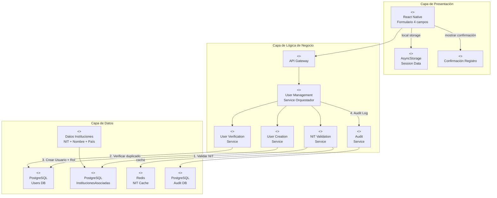
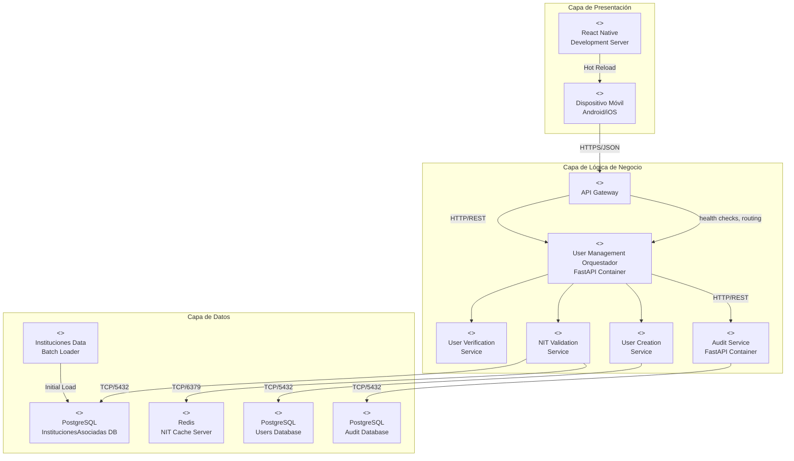
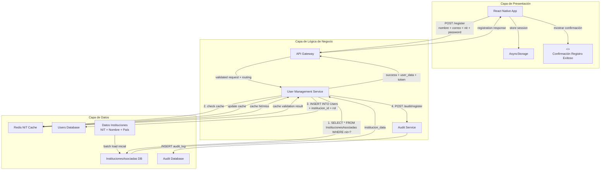
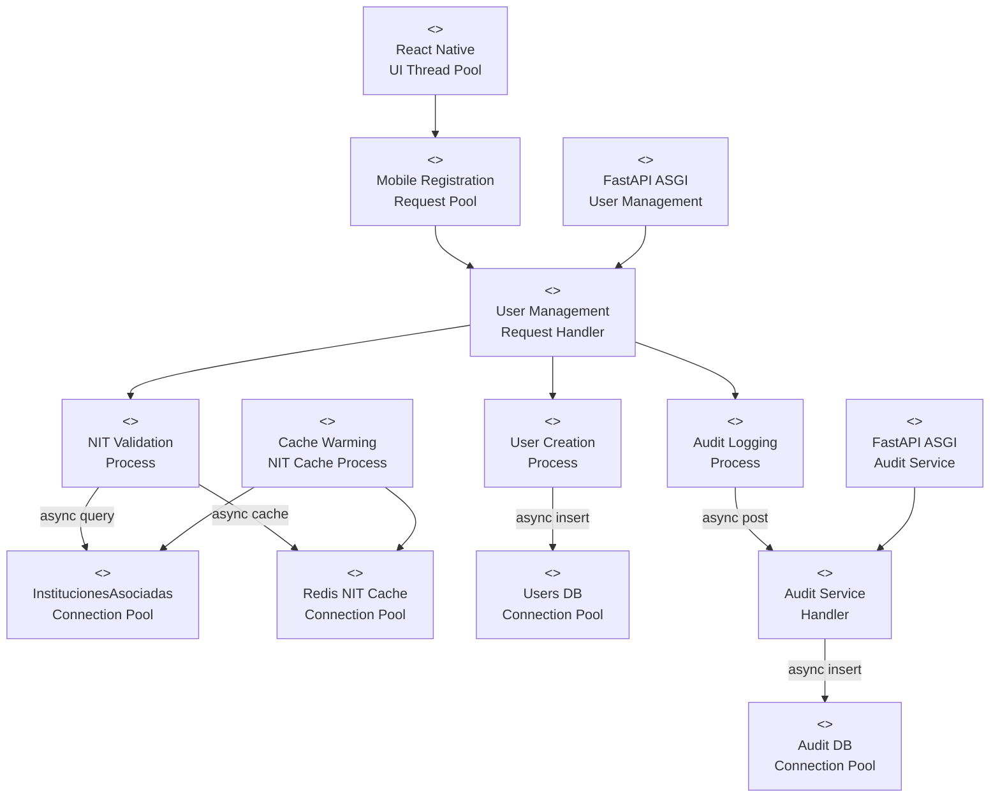

# Vistas Arquitectónicas - Experimento Registro Clientes Institucionales

---

# Vista Funcional – (Estilo Microservicios)

| Proyecto | Vista | ID | Elaboración | Modelo | Versión | Convención |
| --- | --- | --- | --- | --- | --- | --- |
| MediSupply | Funcional | VC-001 | Grupo 4 - Experimento React Native | Estilo Microservicios | 1.0 | Registro Clientes Móvil |

[Diagrama de arquitectura Vista Funcional]



---

# Vista Funcional – (Estilo Microservicios)

Justificaciones y Razonamiento del "Diagrama de arquitectura Vista Funcional"

## Tácticas de arquitectura utilizadas para favorecer la latencia

**Caché Redis para validaciones NIT**: User Management Service utiliza Redis para cachear consultas frecuentes a InstitucionesAsociadas, reduciendo latencia de validación NIT de consultas repetitivas.

**Validación integrada en User Management**: Consolidación de validación NIT, creación de usuario, asignación de roles y auditoría orquestada desde User Management, manteniendo la menor latencia posible y evitando acoplamientos innecesarios.


**API Gateway optimizado**: Implementación de rate limiting, health checks y enrutamiento eficiente para minimizar latencia y garantizar disponibilidad entre la capa de presentación y la de lógica de negocio.

## Razonamiento sobre las principales decisiones de arquitectura tomadas en este modelo

**Separación de responsabilidades por dominio**: Cada microservicio maneja una responsabilidad específica (gestión usuarios, validación tributaria, auditoría) permitiendo escalabilidad independiente y mantenimiento especializado.

**Separación en tres capas**: Presentación (web y móvil), Lógica de negocio (servicios), y Datos (bases de datos y cachés) para escalabilidad e independencia por capa.

<!-- **Consolidación en User Management Service**: Integrar validación NIT directamente en el servicio de gestión de usuarios elimina latencia de comunicación entre microservicios y simplifica el flujo transaccional. -->

**Tabla InstitucionesAsociadas centralizada**: Datos de instituciones autorizadas en tabla dedicada permite control granular de acceso y facilita auditoría de validaciones.

**API Gateway como punto de entrada único**: Centraliza autenticación, autorización, health checks y enrutamiento; simplifica la integración desde React Native y permite redirigir tráfico a instancias saludables durante escalamiento.

**Formulario de 4 campos específicos**: Interfaz React Native optimizada para capturar exactamente los datos requeridos (nombre, correo, NIT, contraseña) sin campos adicionales que aumenten complejidad.

**Asignación automática de roles**: Lógica centralizada en User Management Service garantiza consistencia en asignación de rol "usuario_institucional" basada en validación NIT exitosa.

**Auditoría de eventos críticos**: Servicio separado para auditoría mantiene trazabilidad sin impactar performance del flujo principal de registro.

---

# Vista de despliegue

| Proyecto | Vista | ID | Elaboración | Modelo | Versión | Convención |
| --- | --- | --- | --- | --- | --- | --- |
| MediSupply | Despliegue | VC-002 | Grupo 4 - Experimento React Native | Despliegue Microservicios | 1.0 | Contenedores + Móvil |

[Diagrama de arquitectura Vista Despliegue]



---

# Vista de despliegue

Justificaciones y Razonamiento del "Diagrama de arquitectura Vista Despliegue"

## Tácticas de arquitectura utilizadas para favorecer la disponibilidad

**Contenedorización simplificada**: User Management Service y Audit Service en contenedores independientes permiten aislamiento de fallos y despliegue independiente para el experimento.

**Red Docker interna**: Comunicación entre servicios a través de red Docker privada reduce latencia y proporciona aislamiento de red.

**Separación de bases de datos**: PostgreSQL independiente para Users, InstitucionesAsociadas y Audit evita contención de recursos y permite optimización específica.

**Cache Redis dedicado**: Servidor Redis independiente para caché de validaciones NIT asegura disponibilidad de datos críticos sin impactar bases de datos principales.

## Razonamiento sobre las principales decisiones de arquitectura tomadas en este modelo

**Comunicación a través de API Gateway**: La app móvil se comunica siempre con API Gateway, que realiza validación, health checks y enrutamiento hacia User Management, garantizando disponibilidad y desacoplamiento conforme a la arquitectura en tres capas.

**Bases de datos especializadas**: Separación física entre Users DB e InstitucionesAsociadas DB permite optimización independiente y medición precisa de latencia por tipo de consulta.

**Desarrollo con Hot Reload**: Servidor de desarrollo React Native permite iteración rápida durante las 3 fases del experimento.

**Carga inicial de datos**: Batch loader independiente para poblar InstitucionesAsociadas garantiza datos consistentes para pruebas comparativas.

**Confirmación en-app inmediata**: Notificación de registro exitoso directa en UI móvil elimina dependencias externas y permite medición precisa de latencia end-to-end.

---

# Vista de Información

| Proyecto | Vista | ID | Elaboración | Modelo | Versión | Convención |
| --- | --- | --- | --- | --- | --- | --- |
| MediSupply | Información | VC-003 | Grupo 4 - Experimento React Native | Flujo de Información | 1.0 | Datos Registro Cliente |

[Diagrama de arquitectura Vista de Información]



---

# Vista de Información

Justificaciones y Razonamiento del "Diagrama de arquitectura Vista Información"

## Tácticas de arquitectura utilizadas para favorecer la latencia

**Caché Redis para NIT**: Almacena resultados de consultas a InstitucionesAsociadas, evitando consultas repetitivas a PostgreSQL y reduciendo latencia de validación NIT.

**Flujo secuencial optimizado**: Validación NIT → Creación Usuario → Auditoría en secuencia minimiza transacciones concurrentes y reduce tiempo total.

**Consulta directa a InstitucionesAsociadas**: SELECT directo con índice en NIT proporciona validación O(log n) en lugar de comunicación inter-servicios.

**Almacenamiento local de sesión**: AsyncStorage mantiene datos de sesión localmente, evitando re-autenticación en uso posterior de la app.

## Razonamiento sobre las principales decisiones de arquitectura tomadas en este modelo

**Validación integrada en User Management**: Consolidar validación NIT y creación de usuario en un solo servicio elimina latencia de comunicación entre servicios y simplifica transacciones.

**Tabla InstitucionesAsociadas como fuente única**: Datos de instituciones autorizadas centralizados permiten control granular y facilitan medición precisa de latencia de validación.

**Asignación automática de rol y asociación**: Lógica en User Management Service garantiza que usuarios con NIT válido reciban automáticamente rol "usuario_institucional" y asociación con institución correspondiente.

**Auditoría asíncrona**: Registro de eventos en Audit Service después de completar registro principal evita que auditoría impacte latencia del flujo crítico.

**Datos precargados**: InstitucionesAsociadas poblada por batch loader inicial elimina dependencias externas durante validación en tiempo real.

**Confirmación inmediata en app**: Mensaje de confirmación mostrado directamente en UI móvil tras respuesta exitosa proporciona feedback inmediato al usuario.

---

# Vista de Concurrencia

| Proyecto | Vista | ID | Elaboración | Modelo | Versión | Convención |
| --- | --- | --- | --- | --- | --- | --- |
| MediSupply | Concurrencia | VC-004 | Grupo 4 - Experimento React Native | Procesos Concurrentes | 1.0 | Registro Simultaneo |

[Diagrama de arquitectura Vista de Concurrencia]



---

# Vista de Concurrencia

Justificaciones y Razonamiento del "Diagrama de arquitectura Vista de Concurrencia"

## Tácticas de arquitectura utilizadas para favorecer la disponibilidad

**Pool de conexiones especializados**: User Management Service mantiene pools separados para Users DB e InstitucionesAsociadas DB, evitando contención de recursos entre diferentes tipos de consultas.

**Procesamiento asíncrono secuencial**: FastAPI ASGI maneja validación NIT → creación usuario → auditoría en secuencia asíncrona, optimizando para latencia en lugar de paralelismo.

**Cache warming de NIT**: Proceso background mantiene Redis actualizado con validaciones NIT frecuentes, asegurando disponibilidad de datos críticos sin impactar flujo principal.

**Audit Service independiente**: Procesamiento asíncrono de auditoría en servicio separado evita que logging impacte performance del registro principal.

## Razonamiento sobre las principales decisiones de arquitectura tomadas en este modelo

**Flujo secuencial optimizado**: Validación NIT → Creación Usuario → Auditoría ejecutan secuencialmente para minimizar transacciones concurrentes y medir latencia precisa de cada paso.

**Thread pool React Native**: Interfaz de usuario permanece responsiva mientras validación y registro ejecutan en background, crítico para UX del formulario de 4 campos.

**ASGI para experimento**: FastAPI con ASGI scheduler permite manejar concurrencia de pruebas (10 usuarios simultáneos) sin overhead de threading tradicional.

**Cache management independiente**: Proceso background para warming de caché NIT evita que validaciones en tiempo real compitan por recursos de actualización, garantizando latencia predecible para mediciones comparativas.

---

## Métricas de Validación del Experimento

- **Latencia Fase 1**: Registro sin validación NIT (línea base para comparación)
- **Latencia Fase 2**: Registro con validación NIT completa (<1 segundo objetivo)
- **Diferencia de latencia**: Impacto de validación NIT (<300ms objetivo)
- **Concurrencia objetivo**: 10 registros simultáneos sin degradación >10%
- **Validación NIT**: Consulta a InstitucionesAsociadas (<200ms objetivo)
- **Usabilidad objetivo**: Formulario 4 campos completable en <30 segundos
- **Confirmación objetivo**: Pantalla de confirmación mostrada <1 segundo después de registro exitoso

---

## Criterios de Éxito del Experimento

1. **Latencia Comparativa**: Diferencia entre Fase 1 y Fase 2 <300ms (validación NIT no degrada significativamente performance)
2. **Umbral Absoluto**: Registro completo con validación NIT en <1 segundo en 95% de casos
3. **Funcionalidad**: 100% de NIT válidos en InstitucionesAsociadas permiten registro exitoso con rol y asociación correcta
4. **Arquitectónico**: User Management Service maneja validación integrada sin degradación de concurrencia
5. **Usabilidad**: Formulario de 4 campos intuitivo y completable en tiempo objetivo
6. **Confirmación**: Usuario recibe confirmación inmediata en app tras registro exitoso

---

## Descripción del Flujo de Registro Modificado

### Flujo Completo de Registro
1. **Captura de datos**: Usuario completa formulario React Native con 4 campos (nombre, correo, NIT, contraseña)
2. **Envío a User Management**: POST /register con datos completos
3. **Validación NIT**: Consulta a tabla InstitucionesAsociadas para verificar NIT válido
4. **Creación de usuario**: INSERT en tabla Users con institucion_id y rol "usuario_institucional"
5. **Auditoría**: Registro del evento en Audit Service
6. **Respuesta**: Confirmación exitosa con token JWT
7. **Confirmación UI**: Mensaje de éxito mostrado en pantalla de la app

### Validación y Asignación Automática
- **NIT válido**: Usuario creado con rol "usuario_institucional" y asociado a institución correspondiente
- **NIT inválido**: Registro rechazado con mensaje "NIT no autorizado para registro"
- **Duplicado**: Detección de correo existente con mensaje apropiado

---

## Tabla de Códigos de Respuesta API REST (Registro de Clientes)

| Servicio | Endpoint | Método | Código | Significado | Manejo en App |
| --- | --- | --- | --- | --- | --- |
| API Gateway | N/A (proxy) | N/A | 429 Too Many Requests | Límite de peticiones excedido | Informar y reintentar con backoff |
| API Gateway | N/A (proxy) | N/A | 502/503/504 | Error/Timeout de servicio backend | Mostrar error temporal y reintentar |
| User Management Orquestador | POST /register | POST | 200 OK | Registro exitoso con NIT válido | Mostrar confirmación y navegar a inicio |
| User Management Orquestador | POST /register | POST | 400 Bad Request | Datos inválidos/incompletos | Resaltar campos con error y pedir corrección |
| User Management Orquestador | POST /register | POST | 404 Not Found | NIT no encontrado en InstitucionesAsociadas | Mostrar "NIT no autorizado para registro" |
| User Management Orquestador | POST /register | POST | 409 Conflict | Correo electrónico ya registrado | Mostrar "Usuario ya existe" y ofrecer recuperación |
| User Management Orquestador | POST /register | POST | 422 Unprocessable Entity | Validaciones de formato fallidas | Mostrar mensajes específicos por campo |
| User Management Orquestador | POST /register | POST | 500 Internal Server Error | Error en validación/creación | Mostrar "Error temporal, intente nuevamente" |
| User Verification Service (interno) | GET /users/exists?email= | GET | 200 OK | Verificación ejecutada (exists: true/false) | No aplica (servicio interno) |
| User Verification Service (interno) | GET /users/exists?email= | GET | 400 Bad Request | Parámetro email inválido | No aplica (servicio interno) |
| User Verification Service (interno) | GET /users/exists?email= | GET | 500 Internal Server Error | Error interno de verificación | No aplica (servicio interno) |
| NIT Validation Service (interno) | GET /nits/{nit}/validate | GET | 200 OK | NIT válido (valid: true) | No aplica (servicio interno) |
| NIT Validation Service (interno) | GET /nits/{nit}/validate | GET | 404 Not Found | NIT no existe en InstitucionesAsociadas | No aplica (servicio interno) |
| NIT Validation Service (interno) | GET /nits/{nit}/validate | GET | 400 Bad Request | Formato de NIT inválido | No aplica (servicio interno) |
| NIT Validation Service (interno) | GET /nits/{nit}/validate | GET | 500 Internal Server Error | Error interno de validación | No aplica (servicio interno) |
| User Creation Service (interno) | POST /users | POST | 201 Created | Usuario creado con rol asignado | No aplica (servicio interno) |
| User Creation Service (interno) | POST /users | POST | 400 Bad Request | Datos incompletos/ inválidos | No aplica (servicio interno) |
| User Creation Service (interno) | POST /users | POST | 409 Conflict | Correo ya existe | No aplica (servicio interno) |
| User Creation Service (interno) | POST /users | POST | 422 Unprocessable Entity | Reglas de negocio fallidas | No aplica (servicio interno) |
| User Creation Service (interno) | POST /users | POST | 500 Internal Server Error | Error al crear usuario | No aplica (servicio interno) |
| Audit Service (interno) | POST /audit/register | POST | 200 OK | Evento auditado correctamente | No aplica (servicio interno) |
| Audit Service (interno) | POST /audit/register | POST | 5xx | Error al auditar | No aplica (servicio interno) |

## Contratos de API – Requests/Responses (Registro de Clientes)

### User Management Orquestador – POST /register (externo)
- Headers: Content-Type: application/json
- Request body (JSON):
```json
{
  "nombre": "Clínica Central",
  "email": "admin@clinicacentral.org",
  "nit": "901234567",
  "password": "S3gura!2025"
}
```
- 200 OK (JSON):
```json
{
  "userId": 1287,
  "nit": "901234567",
  "rol": "usuario_institucional",
  "token": "eyJhbGciOiJIUzI1NiIsInR5cCI6IkpXVCJ9...",
  "mensaje": "Registro exitoso"
}
```
- 400 Bad Request (JSON):
```json
{
  "error": "Datos inválidos",
  "detalles": {
    "email": "Formato de correo inválido"
  }
}
```
- 404 Not Found (JSON):
```json
{
  "error": "NIT no autorizado",
  "detalles": { "nit": "901234567 no existe en InstitucionesAsociadas" }
}
```
- 409 Conflict (JSON):
```json
{
  "error": "Usuario ya existe",
  "detalles": { "email": "admin@clinicacentral.org" }
}
```
- 422 Unprocessable Entity (JSON):
```json
{
  "error": "Reglas de negocio fallidas",
  "detalles": { "password": "No cumple política de complejidad" }
}
```
- 500 Internal Server Error (JSON):
```json
{
  "error": "Error interno",
  "traceId": "7a1f2c90-3b8d-4a1e-9c41-b1a7a2f2c1e0"
}
```

### User Verification Service – GET /users/exists?email= (interno)
- 200 OK (JSON):
```json
{ "exists": true }
```
- 400 Bad Request (JSON):
```json
{ "error": "Parámetro email inválido" }
```

### NIT Validation Service – GET /nits/{nit}/validate (interno)
- 200 OK (JSON) – válido:
```json
{
  "valid": true,
  "nit": "901234567",
  "nombreInstitucion": "Clínica Central",
  "pais": "CO"
}
```
- 404 Not Found (JSON) – no registrado:
```json
{ "error": "NIT no encontrado en InstitucionesAsociadas" }
```
- 400 Bad Request (JSON) – formato inválido:
```json
{ "error": "Formato de NIT inválido" }
```

### User Creation Service – POST /users (interno)
- Request body (JSON):
```json
{
  "nombre": "Clínica Central",
  "email": "admin@clinicacentral.org",
  "passwordHash": "$2b$12$C4uK...",
  "nit": "901234567",
  "rol": "usuario_institucional"
}
```
- 201 Created (JSON):
```json
{ "userId": 1287 }
```
- 409 Conflict (JSON):
```json
{ "error": "Correo ya existe" }
```

### Audit Service – POST /audit/register (interno)
- Request body (JSON):
```json
{
  "event": "user_register",
  "request": {"nombreusuario": "Nombre del usuario"
             "useremail": "email@email.com",
             "nit": "901234567"}
  "outcome": "success|fail",
  "action": "email | nit | other",
  "timestamp": "2025-09-14T15:03:21Z UTM",
  "auditid": "a3c1f2c0-7181-4d2e-9b01-1f8b0c9e72e1"
}
```
- 200 OK (JSON):
```json
{ "logged": true }
```
<!-- Nota: La app debe mapear los códigos a mensajes de usuario consistentes y registrar métricas (p50/p95/p99) de latencia por endpoint para monitoreo. -->
